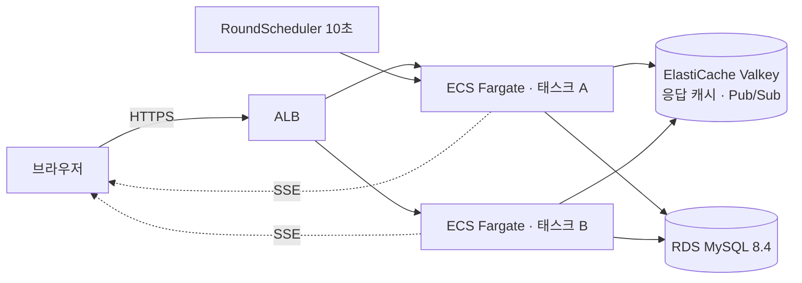

# YU FESTA — 백엔드 · 인프라 · PM
> 영남대학교 2026 가을 축제(10/2)의 공식 웹 서비스. 타임테이블·지도·분실물·응원 메시지, 그리고
> 관심사로 짝을 지어 주는 **인스타팅**. 직접 기획해 팀 3인을 꾸렸고, 당일 **방문 2,080 · 회원 653 · 매칭 692건 · 5xx 0**으로 마쳤습니다.

축제에서 같이 공연 볼 사람을 찾아 주자는 아이디어에서 시작했습니다.
짐작 대신 부하 테스트로 병목을 찾고, 하나를 고칠 때마다 같은 조건으로 다시 쟀습니다.

🌐 [yufesta.com](https://yufesta.com) · ✍️ [기술 블로그](https://velog.io/@ryu2293/posts)

---

## 하루짜리 서비스가 서버에 요구하는 것

낮에는 분당 100건도 안 되다가, 매칭 발표 시각에 모두가 같은 순간 결과를 보러 들어옵니다.
그리고 그날 하루가 끝이라 당일 배포도, 다음 날의 핫픽스도 없습니다. 발표 순간을 버티는 것,
발표를 빨리 보여 주는 것, 그리고 운영 중 어떤 상황이 와도 서버를 다시 띄우지 않고 대응하는 것.
축제 전에 숫자로 확인해 두는 것이 목표였습니다.

> 회차 마감·발표는 태스크 두 개 중 하나의 스케줄러가 DB 행 잠금으로 한 번만 실행하고,
> 그 결과는 Redis Pub/Sub로 두 태스크의 SSE 연결 전체에 퍼집니다.

| 구분 | 수치 |
|---|---|
| 당일 규모 | ALB 요청 **192,052건** · 로그인 회원 653 · 인스타팅 참여 399명 · 신청 700건 |
| 발표 순간 | 분당 요청 578 → **2,763**(초당 46) · p95 **39ms** · 앱 CPU 최대 16% · DB 연결 12 → 16 |
| 매칭 | 세 회차 합계 **692건 전원 매칭** · 불변식 12종 위반 0 · 배치 2\~6초 |
| 안정성 | 5xx **0** · 당일 배포 0 · 헬스체크 정상 태스크 하루 내내 2 |

---

## 1. 인스타팅 — 점수로 짝을 짓고, 발표 전에는 절대 새지 않게

하루 두 회차(현장에서 세 번째를 추가했습니다). 신청자는 관심 태그·함께 보고 싶은 공연·나이대를 적고,
마감 시각에 배치가 돌아 발표 시각에 결과가 공개됩니다.

### 알고리즘

점수는 설정값 가중치 세 개를 더한 값입니다. 공통 태그 수, 같은 공연 선택, 나이대가 같거나 인접한
경우입니다. 이성 간 전원을 점수 내림차순으로 정렬해 1차로 1:1을 먼저 맺고, 남는 다수 측을 소수 측
전원에게 라운드 로빈으로 최대 N명까지 붙입니다. 미매칭 수는 `max(0, 다수 − 소수 × N)`으로 결정되므로
성비가 N:1 안이면 전원 매칭입니다. 600명 고정 시드로 돌린 결과입니다.

| 성비 (총 600명) | 쌍 | 미매칭 | 설명 |
|---|---|---|---|
| 300 : 300 | 300 | 0 | 1:1로 끝 |
| 450 : 150 | 450 | 0 | N=3이 딱 맞는 경계 |
| 480 : 120 | 360 | 120 | 다수 측 120명이 남는다 |
| 540 : 60 | 180 | 360 | N을 올리지 않으면 절반 이상 미매칭 |

N은 설정 테이블의 값이라 배포 없이 바꿉니다. 당일 3회차에서 실제로 그렇게 했습니다.

엔진은 스프링에 의존하지 않는 순수 클래스로 두고, 결과를 바꿀 수 있는 조건을 테스트로 고정했습니다.
동점은 신청 id 순으로 결정적이게, 차단 쌍과 이전 회차에 만난 쌍은 제외, 한쪽이 0명이면 전원 미매칭.
같은 규칙을 SQL로도 적어 리허설과 당일 결과를 실제 MySQL에서 검증했습니다.

### 발표 전에 결과가 새지 않게

`matches`에 결과가 저장되는 시각(마감)과 사용자에게 보이는 시각(발표) 사이에 10분이 있습니다.
결과 조회 API의 기준은 행의 존재가 아니라 **`published_at`이 있는가**입니다.

회차 전이는 `SCHEDULED → OPEN → CLOSED → PUBLISHED` 한 방향이고, 전이 서비스는 회차 행을
`PESSIMISTIC_WRITE`로 잠근 뒤 상태를 검사합니다. 태스크가 두 개여도 늦게 온 쪽은
`MATCH_ROUND_INVALID_STATUS`를 받고 건너뜁니다. 분산 락(ShedLock·Redis SET NX)도 검토했지만,
행 잠금과 전이 검사가 이미 "정확히 한 번"을 보장하므로 헛수고 한 번을 줄이는 것 외에 기여가 없어
넣지 않았습니다.

미매칭자는 발표 트랜잭션 안에서 다음 회차 신청으로 복사됩니다(`CARRIED`). 매칭된 사람이 다음 회차에
또 참여하는 것도 같은 복사(`REJOIN`)라, 신청 화면이 전 회차 내용으로 미리 채워진 채 열립니다.

### 당일 결과

| 회차 | 마감 · 발표 | 풀 (남/여) | 쌍 | 미매칭 | 평균 점수 | 배치 |
|---|---|---|---|---|---|---|
| 1 | 15:50 · 16:00 | 213 (138 / 75) | 138 | 0 | 3.42 | 6초 |
| 2 | 19:50 · 20:00 | 311 (214 / 97) | 214 | 0 | 3.47 | 2초 |
| 3 | 21:50 · 22:00 | 168 (130 / 38) | 130 | 0 | 3.22 | 2초 |

3회차는 계획에 없었습니다. 2회차 발표 뒤 반응이 좋아 DB에 회차 행 하나를 넣는 것으로 열었습니다.
스케줄러가 `open_at`을 보고 10초 안에 자동으로 열었고, SSE로 열려 있던 화면이 "3차 접수 중"으로
바뀌었습니다. 회차 수를 코드 어디에도 가정하지 않은 덕입니다.

신청 마감 10분 전 성비가 3.4:1이었습니다. 위 표대로면 N이 3일 때 다수 측이 남으므로 N을 5로
올렸고, 결과는 전원 매칭이었습니다. 설정값 한 줄이라 배포 없이 끝났습니다.

예상 못 한 사고도 있었습니다. 발표 직후 "동성끼리 매칭됐다"는 글이 올라왔습니다. 정합성 검사는
동성 쌍 0을 보여 줬고, 원인은 신청서에 성별을 반대로 고른 소수의 신청이었습니다. 서버가 검증할 수
없는 값이라 신고 → 운영자 확정 → 다음 회차 풀에서 제외하는 경로로 처리했고(12건 제재), 공지로
상황을 설명했습니다. 발표된 결과는 되돌리지 않는다는 설계 원칙은 지켰습니다.

---

## 2. 부하 테스트가 바꾼 결정 세 가지

목표는 "발표 직후 1,000명이 결과를 조회해도 p95 1초"였습니다. k6로 그 순간을 재현하고,
CloudWatch 1분 지표를 같이 보며 병목을 하나씩 걷어냈습니다. 한 번에 하나만 바꾸고, 바꾼 뒤
같은 조건으로 다시 쟀습니다.

| 단계 | 측정에서 본 것 | 바꾼 것 | 재측정 |
|---|---|---|---|
| ① | 발표 직후 1,000명: CPU 26%인데 Tomcat 스레드 200개 전부 대기, 커넥션 대기 189 | DB 커넥션 풀 10 → 20 | 요약 p95 **4,390 → 415ms**, 커넥션 대기 189 → 12 |
| ② | 처리량 천장 약 600 req/s. 앱 CPU 100%, RDS는 31% | 완성된 응답 문자열을 Redis에 캐시 | 600 req/s에서 CPU **100% → 54\~70%**, 응답 1.6\~3.0s → 4\~13ms |
| ③ | 로그인 요약 한 건이 DB를 **15.3회** 왕복 | 역할을 메모리에 60초 기억, 내 상태를 쿼리 하나로, 캐시 확인을 트랜잭션 밖으로 | DB 왕복 **15.3 → 1.0회**, 600 req/s에서 CPU 74% → 51%, DB 연결 40 → 18 |

> 위는 캐시 전(09-26), 아래는 캐시와 로그인 경로 개선 뒤(09-29)입니다. 주황 띠가 양쪽 모두 같은 600 req/s 구간이고,
> 파란 선이 분당 요청, 빨간 선이 앱 CPU입니다. 같은 요청량에 CPU만 절반으로 내려갔습니다.

### ①에서 배운 것 — 병목은 CPU가 아니었다

첫 측정에서 p95가 4초인데 CPU는 26%였습니다. 스레드 덤프 대신 Hikari 지표를 봤더니 커넥션 대기가
189였습니다. 풀 10개를 200개 스레드가 나눠 쓰고 있었고, 요청 대부분이 DB가 아니라 **DB를 기다리는 줄**에
있었습니다. 풀을 20으로 올리자 p95가 10분의 1이 됐습니다. 그 뒤로 모든 측정에서 DB 연결 수를 함께 봤습니다.

### ③에서 틀렸던 것 — "캐시가 맞으면 DB를 안 읽는다"

캐시를 넣고 나서 "비로그인 요청은 캐시가 맞으면 DB와 통신하지 않는다"고 적었는데, 로컬 MySQL의
general log로 세어 보니 요청마다 5개의 문장이 가고 있었습니다.

`@Transactional(readOnly = true)`가 붙은 메서드는 SELECT를 하나도 안 해도 들어가는 순간 커넥션을
빌리고 여닫기 문장을 보냅니다. 캐시 확인이 그 안에 있었습니다.

캐시를 보는 쪽과 DB를 읽는 쪽을 빈 두 개로 나누고, 캐시 쪽에는 트랜잭션을 붙이지 않았습니다.
조회가 하나뿐인 "내 상태" 메서드도 트랜잭션을 뗐습니다. 묶을 것이 없는데 문장 5개를 더 보내고
있었기 때문입니다.

---

## 3. 응답 캐시 — 완성된 JSON을 URL로 저장했다

### 왜 객체가 아니라 문자열인가

부하 테스트에서 요청당 CPU가 쓰이는 곳은 DB 조회가 아니라 그 뒤의 변환이었습니다. Hibernate 매핑,
DTO 변환, JSON 직렬화입니다. 객체를 캐시하면 그 변환을 요청마다 다시 하므로, **URL을 키로 최종
JSON 문자열**을 저장하고 필터에서 바로 응답합니다.

조건은 "모두에게 같은 응답"입니다. 타임테이블·라인업·장소·공지가 해당하고, 사용자마다 다른 `my`가
섞인 홈 요약은 공통부만 서비스 계층에서 따로 캐시합니다.

### 읽기 — 만료돼도 바로 버리지 않는다

보통 캐시는 TTL이 지나면 값이 사라지고, 그 순간 몰린 요청이 전부 DB로 갑니다. 우리는 값 안에
신선 기한을 따로 적어 두고 Redis에는 그보다 30초 길게 TTL을 겁니다. 홈 요약이면 신선 기한 2초입니다.

2초까지는 그대로 내줍니다. 2초가 지나면 낡은 값을 그대로 내주면서, `SET NX`로 자리를 잡은 요청
하나만 다시 계산해 덮어씁니다. 흔히 stale-while-revalidate라고 부르는 방식에 재계산 락을 더한
것입니다. 덮어쓰면 신선 기한과 TTL이 함께 다시 시작되고, 30초 넘게 아무도 안 오면 자연히 사라집니다.

로컬에서 6,001건을 보내는 동안 재계산은 23회였습니다. 13회는 캐시가 비어 있던 첫 1초에 몰렸고,
나머지 29초는 3초에 한 번씩 10회였습니다. 주기가 신선 기한 2초가 아니라 락 제한 3초였다는 것도
이때 드러나, 재계산이 끝나면 락을 돌려주도록 고쳤습니다.

### 쓰기 — 커밋 뒤에 지운다

운영자가 타임테이블을 고치면 캐시를 지웁니다. 처음엔 서비스 안에서 바로 지웠는데, 트랜잭션 커밋
전에 지우면 그 틈에 들어온 요청이 옛 값을 읽어 캐시에 도로 넣습니다. `TransactionSynchronization`의
`afterCommit`으로 미뤘고, 롤백이면 지우지 않습니다.

다른 응답에 실려 나가는 데이터도 함께 지웁니다. 공연 시간은 라인업 카드에도 있으므로 타임테이블이
바뀌면 라인업도 지웁니다.

### 장애 — fail-open

Redis 호출은 전부 예외를 먹고 DB 경로로 갑니다. Redis 헬스 지표도 ALB 헬스체크에서 뺐습니다.
캐시가 죽었다고 태스크를 내리면 캐시 장애가 전면 장애가 됩니다. 이 선택이 맞았다는 것은 과부하
측정에서 확인됩니다.

당일 발표 순간 캐시 적중률은 96\~99%였고, 요청이 5배로 뛰는 동안 DB 연결은 12에서 16으로 늘었습니다.

---

## 4. 폴링을 빼고 SSE로 — "다시 조회하라"만 보낸다

### 왜 바꿨나

운영 접근 로그로 프론트의 실제 폴링 주기를 확인했더니 홈 요약 30초, 로그인 확인 30초였습니다.
발표가 최대 30초 늦게 보이고, 발표 스파이크 측정에서는 **전체 요청의 97%가 이 폴링**이었습니다.
주기를 줄이면 빨라지는 대신 요청이 배로 늡니다. 즉시 반영과 적은 요청을 함께 얻는 방법은 서버가
바뀐 순간에 알려 주는 것뿐이었습니다.

| 후보 | 판단 |
|---|---|
| 폴링 주기 단축 | 추가 구현 없음. 요청 6배, 지연은 여전히 0이 아님 |
| WebSocket | 양방향이 필요 없음. 쿠키 인증·ALB·자동 재연결을 새로 만들어야 함 |
| **SSE** | HTTP 그대로. 쿠키 인증, ALB, 브라우저 내장 재연결을 공짜로 씀 |

### 이벤트는 신호만

`round-opened` · `round-closed` · `round-published` 세 가지이고, 본문은 `{"roundSeq": n}`뿐입니다.
결과 데이터를 싣지 않습니다. 매칭 결과는 사람마다 달라 어차피 개별 조회가 필요하고, 신호만 보내면
놓친 이벤트의 복구가 "연결되면 한 번 조회"로 끝납니다.

이벤트가 신호뿐이라 재전송할 내용 자체가 없어, `Last-Event-ID` 재전송도 Redis Streams도 넣지 않았습니다.

### 태스크가 둘일 때

연결은 태스크 로컬에 두고 이벤트만 Redis Pub/Sub로 공유합니다(`SseEmitter`는 연결당 스레드를 쓰지
않습니다). Pub/Sub는 유실될 수 있어 각 태스크가 3초마다 현재 회차 상태를 캐시에서 읽어 마지막으로
알린 것과 다르면 그 이벤트를 보냅니다. 두 경로의 중복은 진행 순번(회차 × 10 + 상태)으로 거릅니다.

Redis 구독은 기동 과정에 두지 않았습니다. 리스너 컨테이너를 `autoStartup=false`로 두고 기동 뒤에
붙입니다. 구독을 기동에 넣으면 Redis가 안 될 때 앱이 뜨지 못합니다.

keepalive는 25초입니다. ALB 유휴 제한 60초보다 짧아야 하고, 운영에서 단일 연결을 100초 들고
확인했습니다. 종료 때는 `SmartLifecycle`로 연결을 가장 먼저 닫습니다.

### 운영에서 잰 것

배포 뒤 SSE 연결 1,000개와 30초 폴링 사용자 100명을 함께 두고 운영자가 회차를 마감·발표했습니다.

| 항목 | SSE | 30초 폴링 |
|---|---|---|
| 마감을 알아챈 시각 | **0.15초** 안에 1,000명 전원 | 평균 14.5초 · 최대 29.9초 |
| 발표를 알아챈 시각 | **0.07초** 안에 전원 | 평균 14.9초 · 최대 30.0초 |
| 태스크 간 전달 | 마감을 처리한 태스크는 하나, 다른 태스크의 504건이 0.08초 차이로 수신 | |
| 연결 1,000개 유지 비용 | 앱 CPU 1\~3% (없을 때 1\~2%) | |
| 연결을 든 채 읽기 600 req/s | 실패 0 · p95 60ms · 끊긴 연결 0 | |

### SSE가 만든 새 문제 — 동시 재조회

폴링은 1,000건을 30초에 흩어 놓았는데, SSE는 그걸 같은 순간으로 모읍니다. 미리 열어 둔 연결
1,000개로 요약 조회를 한순간에 보내 봤습니다.

| 서버 상태 | 보내는 방식 | p95 | Redis 시간 초과 |
|---|---|---|---|
| 기동 직후 | 한순간에 1,000건 | 4.8\~6.5초 | 215\~714건 |
| 예열 뒤 | 한순간에 1,000건 | 0.8\~1.2초 | 0 |
| 예열 뒤 | 3초에 흩어 1,000건 | **73ms** | 0 |

두 가지가 결정됐습니다. 프론트는 이벤트를 받으면 0\~3초 무작위로 기다렸다 조회합니다. 발표를 평균
1.5초 늦게 보지만 폴링의 15초보다 훨씬 빠릅니다. 그리고 최종 배포 뒤에는 예열 요청을 보냅니다.

### 당일 실제 모습은 가정과 달랐다

발표 순간 열려 있던 SSE 연결은 태스크 합계 68개였습니다. 다수가 화면을 켜 두고 기다리는 그림이
아니라, 발표 시각에 들어와서 결과를 보고 나가는 그림이었습니다. 요청 피크가 발표 뒤 2\~3분에 걸쳐
있는 것이 그 증거입니다.

하루 SSE 연결 수 17,077은 접근 로그에 찍힌 로그인 회원 645명 기준 1인당 26회입니다. 모바일 화면
끄기, 탭 전환, 30분 연결 TTL이 원인으로 보입니다. 서버 비용은 없었지만 다음에는 재연결 수를 지표로
먼저 보겠습니다.

---

## 5. 한계는 어디이고, 넘으면 어떻게 무너지나

안정 구간을 아는 것만큼 **어떻게 무너지는지**를 아는 것이 중요했습니다. 당일에 그 모양이 보이면
무엇을 눌러야 하는지 미리 정해 둘 수 있기 때문입니다.

> 로그인 50% · 900 req/s. 같은 900인데 더 무거운 로그인 100%는 버티고(CPU 97%) 이쪽은 무너졌습니다.
> 용량이 모자란 것이 아니라 여유가 3%라 작은 흔들림 하나가 한계를 넘깁니다.

연쇄는 이렇습니다.

1. CPU가 포화된다
2. Lettuce 이벤트 루프가 밀려 Redis 명령이 200ms 제한에 걸린다
3. 그 요청이 fail-open으로 DB 경로를 타면서 더 느려진다
4. 헬스체크가 실패한다
5. ALB가 태스크를 빼 용량이 반으로 준다
6. 남은 태스크가 즉시 포화된다

캐시 시간 초과 경고가 8,000건 넘게 쌓이고 15:01에 태스크 하나가 제외됐습니다.

| 측정 | 판단 |
|---|---|
| 안정 구간 | 600 req/s. CPU 50\~55%, 서버 평균 4ms, 경고 0 |
| 한계 | 900 req/s 부근. 버티거나 무너지거나 |
| 실제 축제 피크 | 46 req/s. 안정 구간의 8% |

13배 여유는 과설계가 아니라 측정의 결과입니다. 처음 가정은 1,000명이 5초 폴링, 즉 200 req/s였고,
폴링을 SSE로 바꾼 결정이 피크를 46으로 낮췄습니다. 과부하 보호(헬스체크를 DB 없는 경로로, 연속
타임아웃 시 캐시 우회)는 예상 부하의 4배 이상에서만 필요해 축제 뒤로 미뤘습니다.

---

## 6. 축제 당일

> 파란 선이 분당 요청(왼쪽 축), 빨간 선이 앱 CPU(오른쪽 축). 발표 세 번 모두 앱 CPU는 16% 이하였습니다.
> 하루 중 CPU가 가장 높았던 1분은 발표가 아니라 23:20이었습니다. 분실물 사진 한 장을 서버가 동기로
> 리사이즈하느라 8초를 썼고, 0.5 vCPU에서 75%까지 올랐습니다. "이미지 처리 비동기화"를 개선 후보에
> 둔 이유가 이 1분입니다.

| 발표 | 직전 분 → 발표 분 req/min | 발표 분 p95 / p99 | 캐시 적중률 | DB 연결 | 앱 CPU 최대 |
|---|---|---|---|---|---|
| 1회차 16:00 | 469 → 795 | 37ms / 353ms | 96\~99% | 10 → 11 | 5\~8% |
| 2회차 20:00 | 578 → **2,763** | 39ms / 329ms | 99% | 12 → 16 | 11\~16% |
| 3회차 22:00 | 538 → 1,468 | 99ms / 1,853ms | 97\~99% | 11 → 20 | 5\~7% |

3회차 발표 분의 p99 1.85초는 결과 조회(`results/me`, 사용자마다 달라 캐시 없음)가 몰린 몫이고 1분 뒤
정상이었습니다. 개선 후보로 적어 둔 "발표 직후 결과 프리워밍"이 정확히 이 지점입니다.

당일 손댄 것은 전부 데이터였습니다. 성별 오입력 신고 12건 제재, 매칭 상한 3 → 5, 3회차 행 추가,
타임테이블 LIVE 표시 해제. 배포는 0회였고, Swagger를 끈 상태라 운영자 API는 미리 적어 둔
curl 대응표로 불렀습니다.

### 사용자

| 항목 | 값 |
|---|---|
| 방문 브라우저 / 세션 / 페이지뷰 | 2,080 / 3,850 / 30,100 · 체류 중앙값 9분 42초 |
| 전환 | 방문 2,080 → 로그인 653(31%) → 인스타팅 참여 399(로그인의 61%). 방문은 PostHog, 나머지는 DB 집계 |
| 유입 | 입소문·직접 1,414 · 에브리타임 669 · 인스타그램 63 · 현장 포스터 QR 28 |
| 기기 | Mobile Safari 70% · Chrome 25% |

---

## 7. 관측 — 이 문서의 숫자가 나온 곳

- **부하** — k6 `constant-arrival-rate`로 초당 요청 수를 고정해 개선 전후를 같은 조건에서 비교했습니다.
  SSE는 k6가 스트림을 읽지 못해 asyncio로 1,000 연결을 열고 이벤트 도착 시각을 재는 도구를 따로 만들었습니다.
- **지표** — CloudWatch의 ALB·ECS·RDS·ElastiCache 1분 지표. 1분 데이터는 15일만 보관되므로
  `get-metric-widget-image`로 PNG를 받아 측정한 주에 저장소에 남깁니다.
- **로그** — 요청마다 `[req=요청ID user=회원ID]`를 MDC로 붙여 CloudWatch Logs Insights로 집계했습니다.
  당일 로그인 회원 수, API별 호출 수, 발표 순간 SSE 전송 건수가 여기서 나왔습니다.
- **DB 왕복** — 응답 시간으로는 안 보이는 비용을 로컬 MySQL general log로 셌습니다.
- **사용자** — PostHog. hash 라우팅이라 자동 페이지뷰를 끄고 화면 전환 때 직접 기록했고,
  세션 녹화·IP·식별 정보는 보내지 않습니다.

---

## 기술 스택

| 구분 | 사용 |
|---|---|
| 언어·프레임워크 | Java 17 · Spring Boot 4.1 · Spring Data JPA · Flyway · Caffeine |
| 실시간 | SSE(`SseEmitter`) · Redis Pub/Sub |
| 데이터 | MySQL 8.4 · Redis(Valkey, 응답 캐시·속도 제한) |
| 인프라 | AWS ECS Fargate · ALB · RDS · ElastiCache · S3/CloudFront · SSM · Terraform · GitHub Actions(OIDC) |
| 품질·관측 | k6 · CloudWatch(지표·Logs Insights) · JUnit5 · PostHog |
